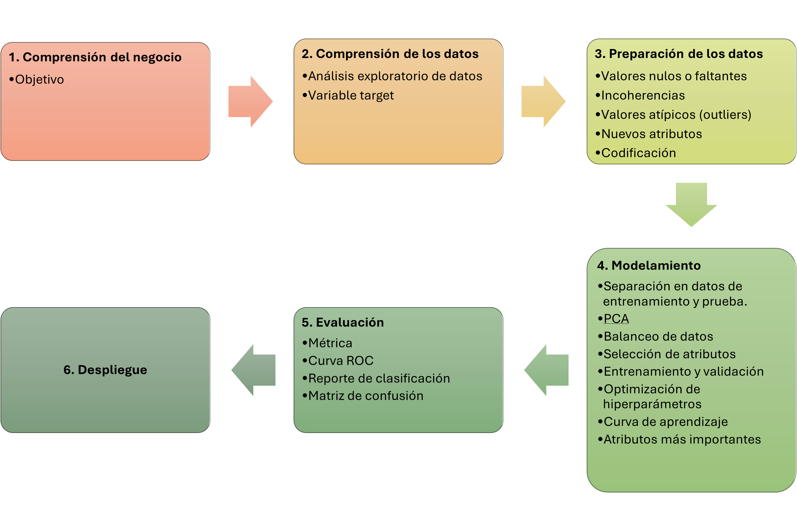

# DP242-G4

### Machine Learning Task
La tarea de este proyecto es del tipo **Clasificacion**. Se va a predecir si un paciente presenta COVID-19 en base al resultado de sus examenes medicos obtenidos.

### Target Variable
La variable target para esta tarea es "SARS-Cov-2 exam result", que indica si un paciente obtuvo positivo o negativo para COVID-19.

### Workflows
Los siguientes workflows describen las propuestas para entrenar al modelo de clasificación:

#### Workflow 1

##### Mejor Modelo: SVC / F1-SCORE: 0.90 / AUC: 0.78

#### Workflow 2

##### Mejor Modelo: AdaBoost / F1-SCORE: 0.90 / AUC: 0.79

#### Workflow 3

##### Mejor Modelo: GradientBoosting / F1-SCORE: 0.76 / AUC: 0.79

#### Workflow 4

##### Mejor Modelo: DecisionTree / F1-SCORE: 0.88

#### Workflow 5

##### Mejor Modelo: ExtraTreesClassifier / F1-SCORE: 0.87 / AUC: 0.805

#### Workflow 6

##### Mejor Modelo: AdaBoost / F1-SCORE: 0.87 / AUC: 0.67

#### Workflow 7

##### Mejor Modelo: SVC / F1-SCORE: 0.90 / AUC: 0.79

#### Workflow 8

##### Mejor Modelo: GradientBoosting / F1-SCORE: 0.86 / AUC: 0.77

#### Workflow 9

##### Mejor Modelo: Ensamble de 3 modelos (GradientBoosting, AdaBoost, CatBoost) / F1-SCORE: 0.91 / AUC: 0.83

#### Workflow 10

##### Mejor Modelo: ExtraTreesClassifier / F1-SCORE: 0.82 / AUC: 0.729
